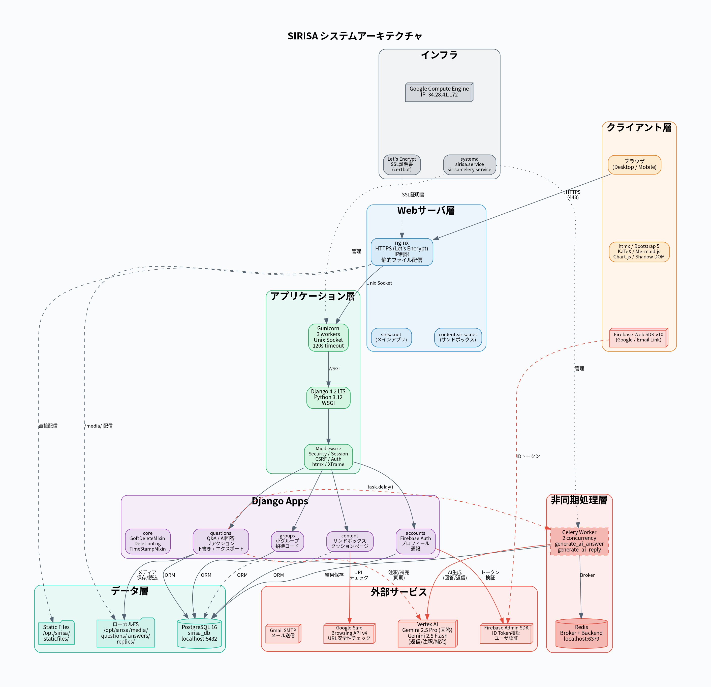

# SIRISA システムアーキテクチャ



## 概要

SIRISA は、大学・高等教育機関向けの Q&A プラットフォームです。  
AI（Vertex AI Gemini）を活用した自動回答・注釈・補完機能を備え、  
小グループによるクローズドな質疑応答もサポートします。

---

## 1. インフラストラクチャ

| コンポーネント | 詳細 |
|:---|:---|
| **コンピュート** | Google Compute Engine (IP: `34.28.41.172`) |
| **OS** | Linux |
| **プロセス管理** | systemd (`sirisa.service`, `sirisa-celery.service`) |
| **SSL証明書** | Let's Encrypt (certbot 自動更新) |
| **ドメイン** | `sirisa.net` (メイン), `content.sirisa.net` (サンドボックス) |

### systemd サービス構成
```
sirisa.service        → Gunicorn (WSGI アプリケーションサーバ)
sirisa-celery.service → Celery Worker (非同期タスク)
```

---

## 2. Web サーバ層

### nginx
- **HTTPS 終端**: Let's Encrypt SSL 証明書
- **IP 制限**: 許可リスト外のアクセスを拒否
- **リバースプロキシ**: Unix ソケット経由で Gunicorn に転送
- **静的ファイル配信**: `/opt/sirisa/staticfiles/` を直接配信
- **メディア配信**: `/opt/sirisa/media/` を直接配信
- **クライアント最大サイズ**: `client_max_body_size 100M`

### ドメイン構成
| ドメイン | 用途 | 特記 |
|:---|:---|:---|
| `sirisa.net` | メインアプリケーション | `X-Frame-Options: DENY` |
| `content.sirisa.net` | AI回答のサンドボックス表示 | `X-Frame-Options: ALLOWALL`, `/content/` パスのみ許可 |

### Firebase Auth プロキシ
nginx は Firebase Auth のリダイレクト URI をプロキシ:
```
/__/auth/  → https://sirisa-f5a1f.firebaseapp.com/__/auth/
/__/firebase/ → https://sirisa-f5a1f.firebaseapp.com/__/firebase/
```
これにより `authDomain=sirisa.net` でのリダイレクト認証が可能。

---

## 3. アプリケーション層

### Gunicorn (WSGI)
| 設定 | 値 |
|:---|:---|
| ワーカー数 | 3 |
| タイムアウト | 120秒 |
| バインド | Unix Socket (`/opt/sirisa/run/gunicorn.sock`) |
| プロトコル | WSGI |

### Django 4.2 LTS
| 設定 | 値 |
|:---|:---|
| Python | 3.12 |
| フレームワーク | Django 4.2 LTS |
| データベースバックエンド | `django.db.backends.postgresql` |
| セッション | DB バックエンド (30日有効) |
| ファイルアップロード上限 | 110MB (`FILE_UPLOAD_MAX_MEMORY_SIZE`) |

### Middleware スタック
```python
SecurityMiddleware          # HTTPS リダイレクト、HSTS
SessionMiddleware           # DB ベースセッション
CommonMiddleware            # URL 正規化
CsrfViewMiddleware          # CSRF 保護
AuthenticationMiddleware    # ユーザ認証
MessageMiddleware           # フラッシュメッセージ
XFrameOptionsMiddleware     # クリックジャッキング防止
HtmxMiddleware              # htmx リクエスト検出
```

---

## 4. Django アプリケーション構成

### accounts
| 機能 | 実装 |
|:---|:---|
| Firebase 認証 | `FirebaseCallbackView`, `verify_id_token()` |
| ユーザ登録 | `RegisterView`, `RegisterForm` |
| プロフィール | `ProfileView`, `EmailChangeView` |
| アカウント削除 | `AccountDeleteView`, `anonymize_for_deletion()` |
| ユーザ通報 | `UserReportView`, `UserReport` モデル |
| 認証バックエンド | `FirebaseAuthBackend` |

### questions
| 機能 | 実装 |
|:---|:---|
| 質問 CRUD | `QuestionCreateView`, `QuestionEditView`, `QuestionDeleteView` |
| 回答 CRUD | `AnswerCreateView`, `AnswerDeleteView` |
| 返信 | `ReplyCreateView` (AJAX) |
| AI 回答生成 | `generate_ai_answer` (Celery タスク) |
| AI 返信生成 | `generate_ai_reply` (Celery タスク) |
| AI 注釈 | `AIAnnotationCreateView` (数式導出 / 単語説明) |
| AI 補完 | `AutoSupplementView` |
| リアクション | `ReactionToggleAPIView` (👍👎 トグル) |
| 下書き自動保存 | `QuestionDraftAPIView`, `AnswerDraftAPIView` |
| エクスポート | `QuestionExportView` (CSV/XLSX/PDF/MD/TXT) |
| 検索・フィルタ | `QuestionListView` (htmx 対応) |
| AI 使用回数制限 | `AIUsageLog` (100回/日) |

### groups
| 機能 | 実装 |
|:---|:---|
| グループ作成 | `StudyGroupCreateView` |
| 招待コード参加 | `StudyGroupJoinView` |
| メンバー管理 | `MemberRemoveView`, `RegenerateCodeView` |
| グループ削除/脱退 | `StudyGroupDeleteView`, `StudyGroupLeaveView` |

### content
| 機能 | 実装 |
|:---|:---|
| サンドボックス表示 | `SandboxedAnswerView` (HMAC トークン検証) |
| クッションページ | `CushionPageView` (Safe Browsing API) |
| リンク書き換え | `_rewrite_links()` |
| CSP 設定 | CDN 許可、connect-src/frame-src ブロック |

### core
| 機能 | 実装 |
|:---|:---|
| 論理削除 | `SoftDeleteMixin`, `SoftDeleteManager` |
| 削除ログ | `DeletionLog` |
| タイムスタンプ | `TimeStampMixin` (`created_at`, `updated_at`) |

### pages
| 機能 | 実装 |
|:---|:---|
| 静的ページ | 使い方、FAQ、お問い合わせ、利用規約、プライバシーポリシー |

---

## 5. 非同期処理層

### Celery Worker
| 設定 | 値 |
|:---|:---|
| 同時実行数 | 2 |
| ブローカー | Redis (`redis://127.0.0.1:6379/0`) |
| リザルトバックエンド | Redis |
| 管理 | systemd (`sirisa-celery.service`) |

### 非同期タスク一覧
| タスク | トリガー | 処理内容 |
|:---|:---|:---|
| `generate_ai_answer` | 質問投稿時 | Gemini 2.5 Pro で通常回答 + スライド回答を並行生成 |
| `generate_ai_reply` | `@ai` を含む返信投稿時 | Gemini 2.5 Flash でスレッド文脈に基づく返信を生成 |

### 非同期フロー
```
View → task.delay() → Redis (enqueue) → Celery Worker (dequeue)
    → Vertex AI API 呼び出し → DB 更新 (Answer/Reply)
    → Frontend ポーリング → 完了検出 → HTML 差し替え
```

---

## 6. データ層

### PostgreSQL 16
| 設定 | 値 |
|:---|:---|
| データベース名 | `sirisa_db` |
| ユーザ | `sirisa_user` |
| ホスト | `localhost:5432` |

### 主要モデル一覧
| モデル | アプリ | 用途 |
|:---|:---|:---|
| `User` | accounts | カスタムユーザ (Firebase UID, 匿名化対応) |
| `UserReport` | accounts | ユーザ通報 |
| `Question` | questions | 質問 (SoftDeleteMixin) |
| `Answer` | questions | 回答 (AI/ユーザ、通常/スライド) |
| `Reply` | questions | 返信 (AI/ユーザ) |
| `Reaction` | questions | リアクション (👍👎) |
| `AIAnnotation` | questions | AI 注釈キャッシュ (数式/単語) |
| `QuestionDraft` / `AnswerDraft` | questions | 下書き自動保存 |
| `QuestionMedia` / `AnswerMedia` / `ReplyMedia` | questions | メディアファイル |
| `AIUsageLog` | questions | AI 使用回数 (日別) |
| `Subject` | questions | 教科マスタ |
| `StudyGroup` | groups | 小グループ |
| `GroupMembership` | groups | グループメンバー |
| `DeletionLog` | core | 削除監査ログ |

### ファイルストレージ
| パス | 用途 |
|:---|:---|
| `/opt/sirisa/media/questions/{pk}/` | 質問添付ファイル |
| `/opt/sirisa/media/answers/{pk}/` | 回答添付ファイル |
| `/opt/sirisa/media/replies/{pk}/` | 返信添付ファイル |
| `/opt/sirisa/staticfiles/` | Django collectstatic 出力 |

ファイル削除は `django-cleanup` で自動管理（モデルレコード削除時に孤立ファイルを自動削除）。

---

## 7. 外部サービス

### Vertex AI (Google Cloud)
| モデル | 用途 | 呼び出し元 |
|:---|:---|:---|
| `gemini-2.5-pro` | AI 回答生成 (通常 + スライド) | Celery タスク (非同期) |
| `gemini-2.5-flash` | AI 返信、注釈、補完 | Celery タスク / ビュー (同期) |

- リージョン: `us-central1`
- プロジェクト: `sirisa`
- マルチモーダル対応: 画像/音声/動画を `Part.from_data()` で入力

### Firebase Authentication
| 機能 | 詳細 |
|:---|:---|
| クライアント SDK | Firebase Web SDK v10 (compat) |
| 認証方法 | Google Sign-In (`signInWithRedirect`), Email Link (`sendSignInLinkToEmail`) |
| サーバ検証 | Firebase Admin SDK 7.1.0 (`verify_id_token`) |
| authDomain | `sirisa.net` (nginx プロキシ経由) |

### Google Safe Browsing API v4
- AI 回答内の外部リンクの安全性をチェック
- 脅威タイプ: MALWARE, SOCIAL_ENGINEERING, UNWANTED_SOFTWARE, POTENTIALLY_HARMFUL_APPLICATION
- タイムアウト: 5秒 (失敗時は安全と判定)

### Gmail SMTP
- メール送信用 (Firebase Email Link 等)

---

## 8. フロントエンド技術スタック

| 技術 | 用途 |
|:---|:---|
| **htmx** | 部分更新 (質問リスト、フィルタ) |
| **Bootstrap 5.3** | UI フレームワーク |
| **Shadow DOM** | AI 回答の CSS/JS 隔離 |
| **KaTeX** | 数式レンダリング |
| **Mermaid.js** | ダイアグラム描画 |
| **Chart.js** | グラフ描画 |
| **Firebase Web SDK** | クライアント認証 |

### Shadow DOM によるAI回答隔離
1. `sanitize_ai_html()` でHTML消毒 (integrity属性除去、DOCTYPE除去、未閉じタグ補完)
2. `initShadowDOM()` で Shadow Root (mode: open) 作成
3. スクリプト再実行 (`mermaid.initialize` 除去、IIFE 関数を window に公開)
4. KaTeX / Mermaid / Chart.js を Shadow DOM 内でレンダリング

---

## 9. セキュリティ設計

| 対策 | 実装 |
|:---|:---|
| HTTPS 強制 | nginx + Let's Encrypt |
| IP 制限 | nginx `allow/deny` |
| CSRF 保護 | Django `CsrfViewMiddleware` |
| XSS 対策 | Django テンプレートオートエスケープ, Shadow DOM 隔離 |
| クリックジャッキング | `X-Frame-Options: DENY` (メインドメイン) |
| セッション管理 | DB バックエンド, 30日有効 |
| Firebase トークン検証 | Admin SDK でサーバサイド検証 |
| サンドボックス | 別ドメイン (`content.sirisa.net`) + CSP |
| Safe Browsing | 外部リンクの安全性チェック |
| 論理削除 | `SoftDeleteMixin` + `DeletionLog` (復元可能) |
| アカウント匿名化 | UUID による一意制約解放 |
| AI レート制限 | 100回/日/ユーザ |
