# SIRISA 機能別処理フロー説明

全22機能の処理フローについて、各機能の概要・主要ファイル・フロー詳細を説明します。

---

## 目次

### 既存8機能
1. [質問投稿](#1-質問投稿)
2. [回答投稿](#2-回答投稿)
3. [返信](#3-返信)
4. [AI返信](#4-ai返信)
5. [数式の導出過程表示](#5-数式の導出過程表示)
6. [単語の意味説明](#6-単語の意味説明)
7. [小グループ](#7-小グループ)
8. [ログイン (Firebase)](#8-ログイン-firebase)

### 追加14機能
9. [ユーザ登録](#9-ユーザ登録)
10. [質問検索・絞り込み](#10-質問検索絞り込み)
11. [リアクション（👍👎）](#11-リアクション)
12. [下書き自動保存](#12-下書き自動保存)
13. [エクスポート](#13-エクスポート)
14. [サンドボックス回答表示](#14-サンドボックス回答表示)
15. [外部リンク Safe Browsing](#15-外部リンク-safe-browsing)
16. [プロフィール編集](#16-プロフィール編集)
17. [アカウント削除（匿名化）](#17-アカウント削除匿名化)
18. [ユーザ通報](#18-ユーザ通報)
19. [質問編集](#19-質問編集)
20. [自動補完 (AutoSupplement)](#20-自動補完-autosupplement)
21. [AI使用回数制限](#21-ai使用回数制限)
22. [メディアアップロード](#22-メディアアップロード)

---

## 1. 質問投稿

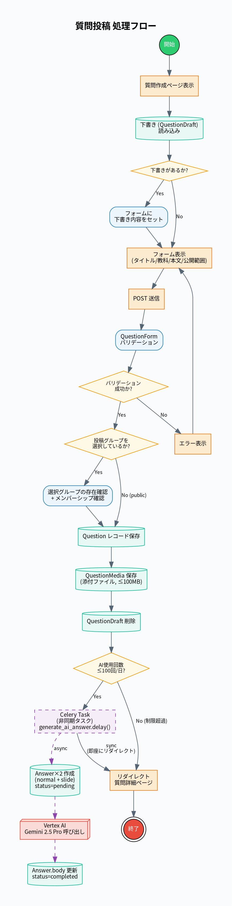

### 概要
ユーザが質問を作成・投稿し、AI が自動生成回答を非同期で作成する機能。

### 主要ファイル
| ファイル | 役割 |
|:---|:---|
| `questions/views.py` | `QuestionCreateView` |
| `questions/forms.py` | `QuestionForm` |
| `questions/tasks.py` | `generate_ai_answer` (Celery) |
| `questions/models.py` | `Question`, `QuestionDraft`, `QuestionMedia` |
| `questions/templates/questions/create.html` | 作成フォーム |

### フロー詳細
1. `QuestionDraft` から下書きを読み込み、フォームにプリフィル
2. タイトル・教科・本文・公開範囲を入力
3. `QuestionForm` バリデーション（失敗時はエラー表示）
4. グループ選択時はメンバーシップ確認
5. `Question` レコード保存 → `QuestionMedia` 保存（≤100MB）→ 下書き削除
6. `AIUsageLog.can_use()` チェック → `generate_ai_answer.delay()` で Celery タスク起動
7. 非同期で `Answer` × 2（通常 + スライド）を `status=pending` で作成
8. Vertex AI Gemini 2.5 Pro 呼び出し → `Answer.body` 更新、`status=completed`
9. ユーザは即座に質問詳細ページへリダイレクト

---

## 2. 回答投稿

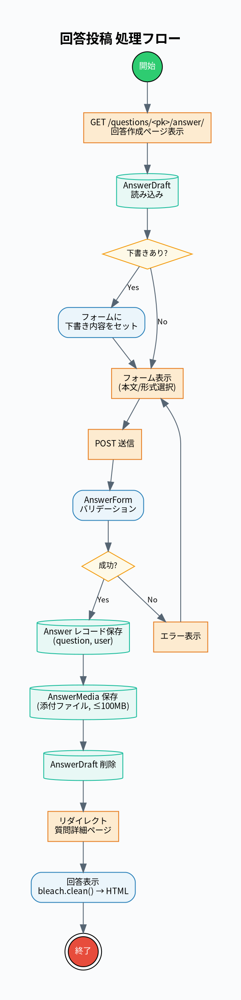

### 概要
ユーザが質問に対して回答を投稿する機能。

### 主要ファイル
| ファイル | 役割 |
|:---|:---|
| `questions/views.py` | `AnswerCreateView` |
| `questions/forms.py` | `AnswerForm` |
| `questions/models.py` | `Answer`, `AnswerDraft`, `AnswerMedia` |

### フロー詳細
1. `AnswerDraft` から下書きを読み込み
2. 本文・形式を入力
3. `AnswerForm` バリデーション
4. `Answer` レコード保存 → `AnswerMedia` 保存 → 下書き削除
5. 質問詳細ページへリダイレクト、`bleach.clean()` で HTML サニタイズして表示

---

## 3. 返信

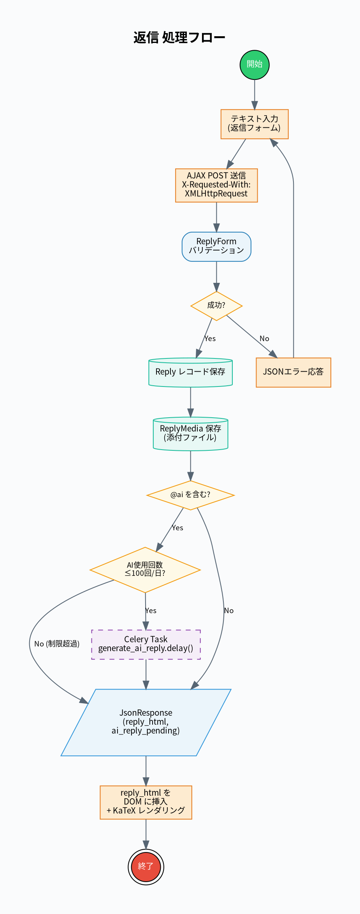

### 概要
回答に対してユーザが返信を AJAX で投稿する機能。`@ai` を含む場合は AI 返信を自動生成。

### 主要ファイル
| ファイル | 役割 |
|:---|:---|
| `questions/views.py` | `ReplyCreateView` |
| `questions/models.py` | `Reply`, `ReplyMedia` |
| `questions/tasks.py` | `generate_ai_reply` (Celery) |

### フロー詳細
1. テキスト入力 → AJAX POST (`X-Requested-With: XMLHttpRequest`)
2. `ReplyForm` バリデーション（失敗時は JSON エラー応答）
3. `Reply` / `ReplyMedia` 保存
4. `@ai` 検出 → `AIUsageLog` チェック → `generate_ai_reply.delay()` 起動
5. `JsonResponse` で `reply_html` + `ai_reply_pending` フラグ返却
6. フロントエンドが DOM に挿入、KaTeX レンダリング

---

## 4. AI返信

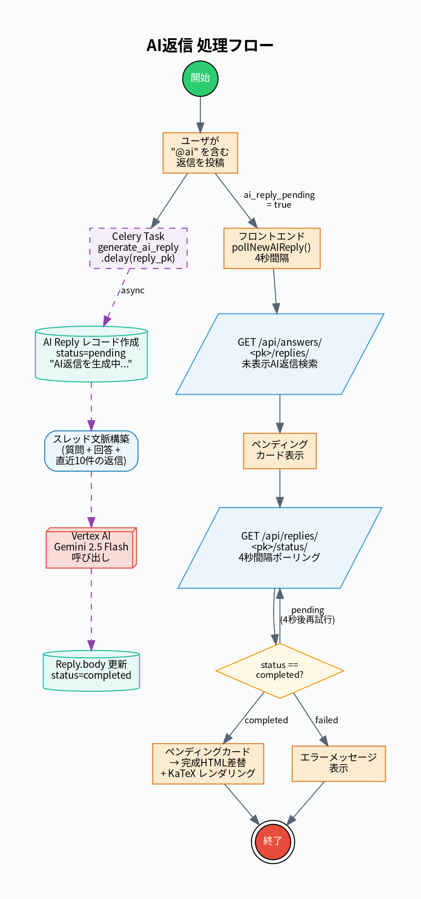

### 概要
Celery で非同期生成される AI 返信と、フロントエンドでのポーリング・表示フロー。

### 主要ファイル
| ファイル | 役割 |
|:---|:---|
| `questions/tasks.py` | `generate_ai_reply` タスク |
| `questions/services/gemini_service.py` | `generate_reply()` |
| `questions/views.py` | `ReplyStatusAPIView`, `AnswerRepliesAPIView` |

### フロー詳細
1. `@ai` を含む返信投稿がトリガー
2. Celery タスクが AI Reply レコード作成（`status=pending`）
3. スレッド文脈構築（質問 + 回答 + 直近10件の返信）
4. Vertex AI Gemini 2.5 Flash 呼び出し → `Reply.body` 更新
5. フロントエンドが `pollNewAIReply()` で4秒間隔ポーリング
6. `GET /api/answers/<pk>/replies/` で未表示 AI 返信検索
7. ペンディングカード表示 → ステータスポーリング → `completed` で HTML 差し替え

---

## 5. 数式の導出過程表示

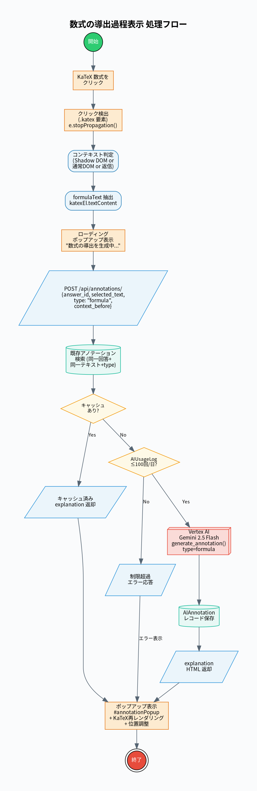

### 概要
KaTeX でレンダリングされた数式をクリックすると、AI がその導出過程を生成・表示する機能。

### 主要ファイル
| ファイル | 役割 |
|:---|:---|
| `questions/views.py` | `AIAnnotationCreateView` |
| `questions/services/gemini_service.py` | `generate_annotation(type="formula")` |
| `questions/models.py` | `AIAnnotation` |

### フロー詳細
1. KaTeX 数式クリック → `e.stopPropagation()` で折りたたみ競合防止
2. コンテキスト判定（Shadow DOM / 通常 DOM / 返信エリア）
3. `formulaText` 抽出 → ローディングポップアップ表示
4. `POST /api/annotations/` → 既存キャッシュ検索
5. キャッシュあり → 即返却 / なし → AI 使用回数チェック → Gemini 呼び出し
6. `AIAnnotation` 保存 → explanation HTML 返却 → ポップアップ表示 + KaTeX 再レンダリング

---

## 6. 単語の意味説明

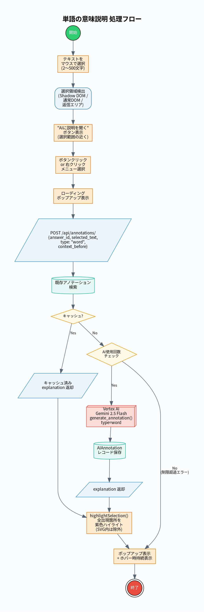

### 概要
テキストを選択すると「AIに説明を聞く」ボタンが表示され、AI が用語の意味を説明する機能。

### 主要ファイル
| ファイル | 役割 |
|:---|:---|
| `questions/views.py` | `AIAnnotationCreateView` |
| `questions/services/gemini_service.py` | `generate_annotation(type="word")` |

### フロー詳細
1. テキスト選択（2〜500文字）→ 選択領域検出
2. 「AIに説明を聞く」ボタン表示 → クリック
3. `POST /api/annotations/` → キャッシュ検索 → Gemini 呼び出し
4. `highlightSelection()` で全出現箇所を紫色ハイライト（SVG 除外）
5. ポップアップで explanation 表示（ホバー時持続）

---

## 7. 小グループ

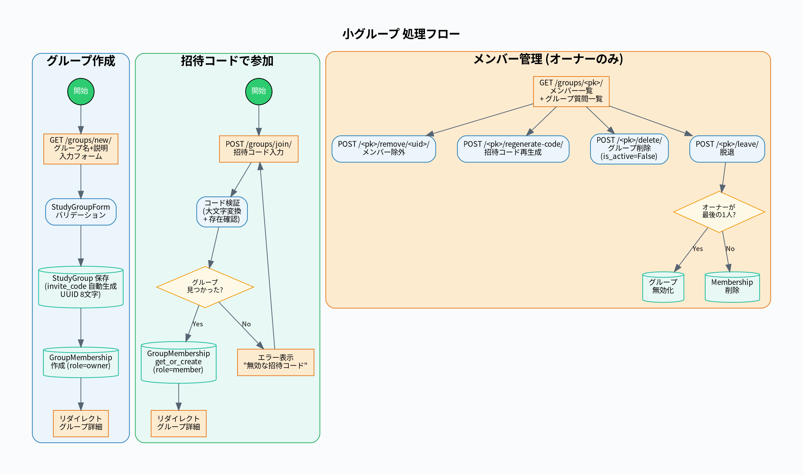

### 概要
小グループの作成・招待コードによる参加・メンバー管理機能。

### 主要ファイル
| ファイル | 役割 |
|:---|:---|
| `groups/views.py` | `StudyGroupCreateView`, `StudyGroupJoinView` 等 |
| `groups/models.py` | `StudyGroup`, `GroupMembership` |

### フロー詳細
#### グループ作成
- グループ名 + 説明入力 → `StudyGroup` 保存（`invite_code` UUID 8文字自動生成）→ `GroupMembership(role=owner)` 作成

#### 招待コードで参加
- コード入力 → 大文字変換 + 存在確認 → `GroupMembership.get_or_create(role=member)`

#### メンバー管理（オーナーのみ）
- メンバー除外、招待コード再生成、グループ削除（`is_active=False`）、脱退

---

## 8. ログイン (Firebase)

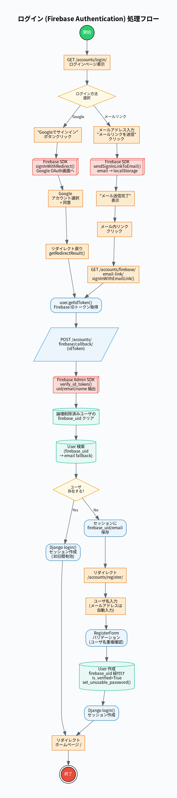

### 概要
Firebase Authentication を利用した Google / メールリンク認証。

### 主要ファイル
| ファイル | 役割 |
|:---|:---|
| `accounts/views.py` | `LoginView`, `FirebaseCallbackView` |
| `accounts/firebase_auth.py` | `verify_id_token()` |
| `accounts/backends.py` | `FirebaseAuthBackend` |

### フロー詳細
1. ログイン方法選択（Google / メールリンク）
2. **Google**: `signInWithRedirect()` → OAuth 同意 → `getRedirectResult()`
3. **メールリンク**: `sendSignInLinkToEmail()` → メール受信 → `signInWithEmailLink()`
4. `user.getIdToken()` → `POST /accounts/firebase/callback/` に ID トークン送信
5. `verify_id_token()` で Firebase Admin SDK 検証 → UID/email/name 抽出
6. 既存ユーザ → `login()` + セッション作成 → ホームへリダイレクト
7. 新規ユーザ → セッション保存 → 登録ページへリダイレクト

---

## 9. ユーザ登録

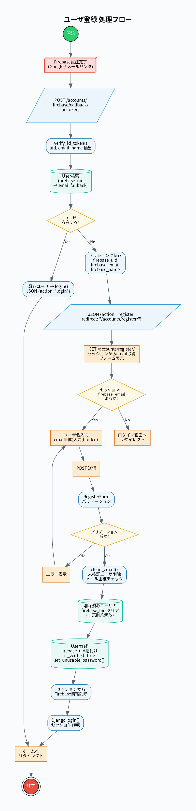

### 概要
Firebase 認証後、ユーザ名を入力して Django ユーザを作成する登録フロー。

### 主要ファイル
| ファイル | 役割 |
|:---|:---|
| `accounts/views.py` | `RegisterView` |
| `accounts/forms.py` | `RegisterForm` |

### フロー詳細
1. Firebase 認証完了 → `FirebaseCallbackView` がセッションに `firebase_uid/email/name` 保存
2. JSON `{action: "register"}` → 登録ページへリダイレクト
3. セッションから email 取得して自動入力（hidden）、ユーザ名入力
4. `RegisterForm` バリデーション（ユーザ名重複確認）
5. `clean_email()`: 未検証ユーザ削除、メール重複チェック
6. 削除済みユーザの `firebase_uid` クリア（一意制約解放）
7. `User` 作成: `firebase_uid` 紐付け、`is_verified=True`、`set_unusable_password()`
8. `login()` でセッション作成 → ホームへリダイレクト

---

## 10. 質問検索・絞り込み

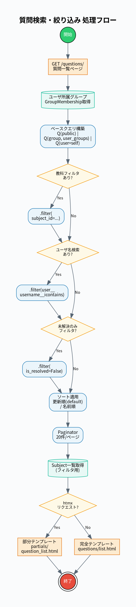

### 概要
教科・ユーザ名・解決状態によるフィルタリングと htmx による部分更新。

### 主要ファイル
| ファイル | 役割 |
|:---|:---|
| `questions/views.py` | `QuestionListView` |
| `questions/templates/questions/list.html` | フィルタ UI |
| `questions/templates/questions/partials/question_list.html` | 部分テンプレート |

### フロー詳細
1. ユーザ所属グループ取得 (`GroupMembership`)
2. ベースクエリ: `Q(public) | Q(group, user_groups) | Q(user=self)`
3. フィルタ適用: 教科 → ユーザ名 (`icontains`) → 未解決のみ
4. ソート: 更新順 (default) / 名前順
5. `Paginator(20件/ページ)` → `Subject` 一覧取得
6. htmx リクエスト → 部分テンプレート / 通常 → 完全テンプレート

---

## 11. リアクション（👍👎）

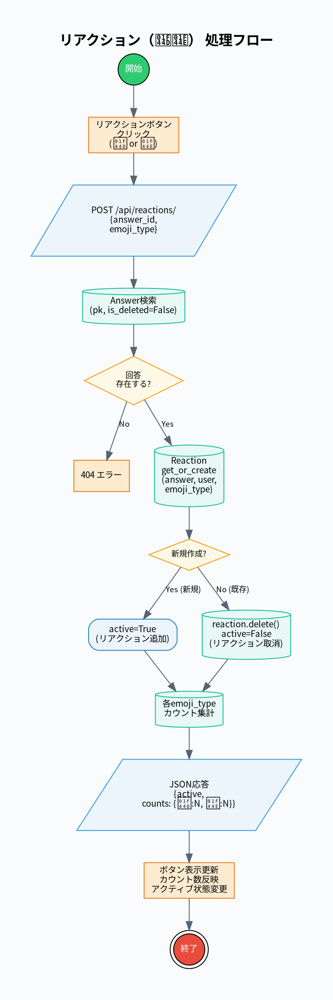

### 概要
回答に対する「いいね」「よくない」のトグル操作。

### 主要ファイル
| ファイル | 役割 |
|:---|:---|
| `questions/views.py` | `ReactionToggleAPIView` |
| `questions/models.py` | `Reaction` (`unique_together: [answer, user, emoji_type]`) |

### フロー詳細
1. リアクションボタンクリック → `POST /api/reactions/` に `{answer_id, emoji_type}`
2. `Answer` 検索 (`is_deleted=False`)
3. `Reaction.objects.get_or_create()`:
   - 新規作成 → `active=True`（リアクション追加）
   - 既存 → `reaction.delete()`, `active=False`（リアクション取消）
4. 各 emoji_type のカウント集計
5. JSON 応答: `{active, counts: {thumbs_up: N, thumbs_down: N}}`
6. フロントエンドでボタン表示・カウント更新

---

## 12. 下書き自動保存

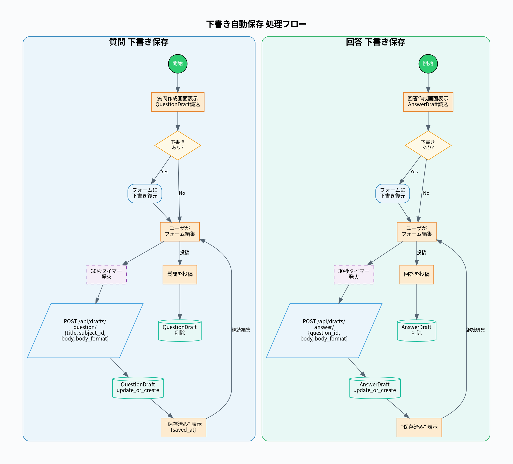

### 概要
質問・回答作成中に30秒間隔で自動保存し、画面再表示時に復元する機能。

### 主要ファイル
| ファイル | 役割 |
|:---|:---|
| `questions/views.py` | `QuestionDraftAPIView`, `AnswerDraftAPIView` |
| `questions/models.py` | `QuestionDraft`, `AnswerDraft` |

### フロー詳細
#### 質問下書き
1. 質問作成画面表示 → 既存 `QuestionDraft` 読み込み → フォーム復元
2. 30秒タイマー → `POST /api/drafts/question/` → `QuestionDraft.update_or_create()`
3. `{status: "saved", saved_at}` → 「保存済み」表示
4. 質問投稿成功時 → `QuestionDraft` 削除

#### 回答下書き
1. 同パターン: `AnswerDraft` + `POST /api/drafts/answer/`
2. `question_id` 必須で紐付け

---

## 13. エクスポート

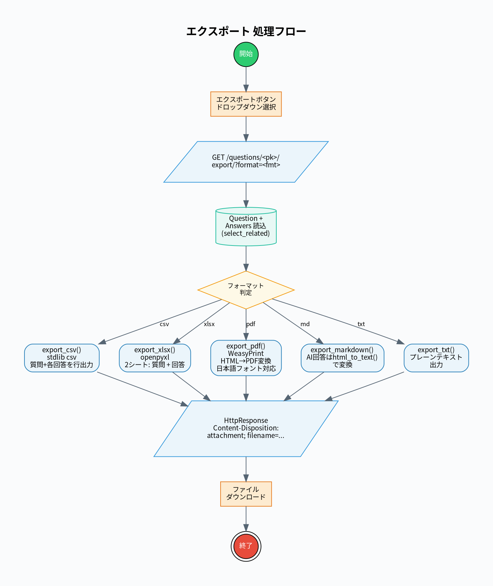

### 概要
質問と全回答を5つの形式でダウンロード出力する機能。

### 主要ファイル
| ファイル | 役割 |
|:---|:---|
| `questions/views.py` | `QuestionExportView` |
| `questions/export.py` | 各フォーマットのエクスポーター |

### フロー詳細
| 形式 | 関数 | ライブラリ | 特記 |
|:---|:---|:---|:---|
| CSV | `export_csv()` | `csv` (stdlib) | UTF-8 BOM 付き |
| XLSX | `export_xlsx()` | `openpyxl` | 2シート: 質問 + 回答 |
| PDF | `export_pdf()` | `WeasyPrint` | HTML→PDF、日本語フォント対応 |
| Markdown | `export_markdown()` | plain text | AI 回答は `html_to_text()` 変換 |
| TXT | `export_txt()` | plain text | テキスト出力 |

---

## 14. サンドボックス回答表示

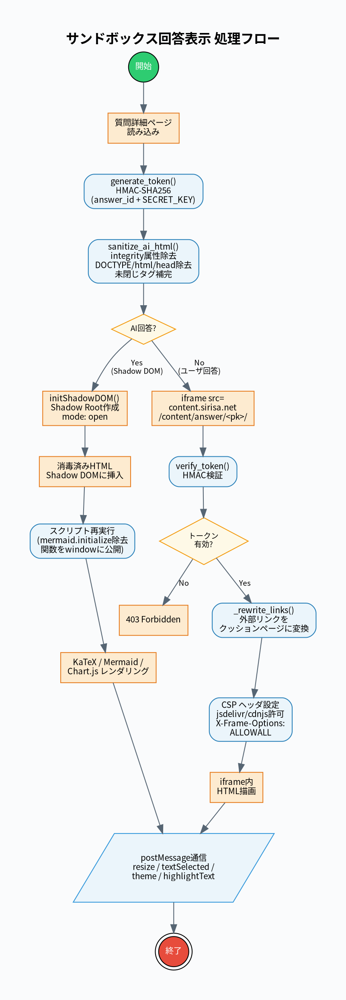

### 概要
AI 回答の HTML/CSS/JS を Shadow DOM または iframe で安全に隔離表示する機能。

### 主要ファイル
| ファイル | 役割 |
|:---|:---|
| `content/views.py` | `SandboxedAnswerView`, `generate_token()`, `verify_token()` |
| `questions/utils.py` | `sanitize_ai_html()` |
| `questions/templates/questions/detail.html` | `initShadowDOM()` |

### フロー詳細
#### Shadow DOM パス（AI 回答）
1. `generate_token()` で HMAC-SHA256 トークン生成
2. `sanitize_ai_html()`: integrity 属性除去、DOCTYPE 除去、未閉じタグ補完
3. `initShadowDOM()` で Shadow Root 作成 (mode: open)
4. スクリプト再実行 (`mermaid.initialize` 除去、IIFE 関数を window に公開)
5. KaTeX / Mermaid / Chart.js レンダリング

#### iframe パス（`content.sirisa.net`）
1. `verify_token()` で HMAC 検証 → `_rewrite_links()` で外部リンク変換
2. CSP ヘッダ設定 (jsdelivr/cdnjs 許可) + `X-Frame-Options: ALLOWALL`
3. `postMessage` 通信: `resize`, `textSelected`, `theme`, `highlightText`

---

## 15. 外部リンク Safe Browsing

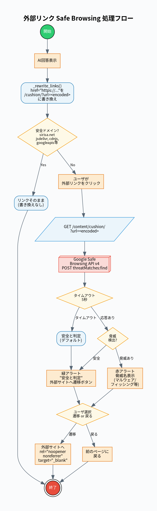

### 概要
AI 回答内の外部リンクをクッションページ経由に書き換え、Google Safe Browsing API で安全性を確認する機能。

### 主要ファイル
| ファイル | 役割 |
|:---|:---|
| `content/views.py` | `CushionPageView`, `_rewrite_links()`, `_check_safe_browsing()` |

### フロー詳細
1. `_rewrite_links()` が AI 回答内の `href="https://..."` を `/cushion/?url=<encoded>` に書き換え
2. 安全ドメイン（sirisa.net, jsdelivr, cdnjs, googleapis 等）はスキップ
3. ユーザがリンクをクリック → `CushionPageView` でクッションページ表示
4. `_check_safe_browsing()`: Google Safe Browsing API v4 に POST
   - 脅威タイプ: MALWARE, SOCIAL_ENGINEERING, UNWANTED_SOFTWARE, POTENTIALLY_HARMFUL_APPLICATION
   - タイムアウト: 5秒（失敗時は安全と判定）
5. 安全 → 緑アラート / 脅威あり → 赤アラート + 脅威名表示
6. 遷移ボタン (`rel="noopener noreferrer" target="_blank"`) + 戻るボタン

---

## 16. プロフィール編集

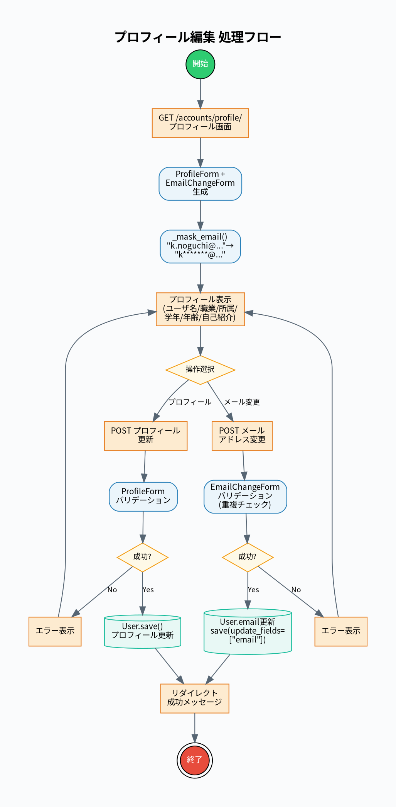

### 概要
ユーザ名・職業・所属・学年・年齢・自己紹介の変更とメールアドレス変更。

### 主要ファイル
| ファイル | 役割 |
|:---|:---|
| `accounts/views.py` | `ProfileView`, `EmailChangeView` |
| `accounts/forms.py` | `ProfileForm`, `EmailChangeForm` |

### フロー詳細
1. `ProfileForm` + `EmailChangeForm` 生成、メールを `_mask_email()` でマスク表示
2. プロフィール更新: `ProfileForm` バリデーション → `User.save()`
3. メール変更: `EmailChangeForm` バリデーション（重複チェック） → `User.email` 更新

---

## 17. アカウント削除（匿名化）

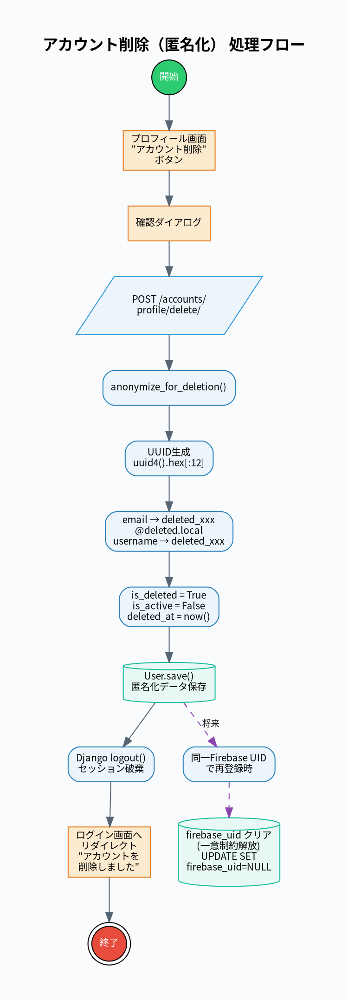

### 概要
アカウントを論理削除し、個人情報を匿名化して再登録を可能にする機能。

### 主要ファイル
| ファイル | 役割 |
|:---|:---|
| `accounts/views.py` | `AccountDeleteView` |
| `accounts/models.py` | `User.anonymize_for_deletion()` |

### フロー詳細
1. 確認ダイアログ → `POST /accounts/profile/delete/`
2. `anonymize_for_deletion()`:
   - UUID サフィックス生成 (`uuid4().hex[:12]`)
   - `email = "deleted_{suffix}@deleted.local"`, `username = "deleted_{suffix}"`
   - `is_deleted=True`, `is_active=False`, `deleted_at=now()`
3. `logout()` → ログイン画面へリダイレクト
4. 再登録時: `firebase_uid` クリアで一意制約を解放

### 設計上の特徴
- **論理削除**: FK 整合性維持（`on_delete=PROTECT`）
- **一意制約解放**: UUID サフィックスで email/username の再利用防止
- **`SoftDeleteManager`**: `is_deleted=False` のみを返す

---

## 18. ユーザ通報

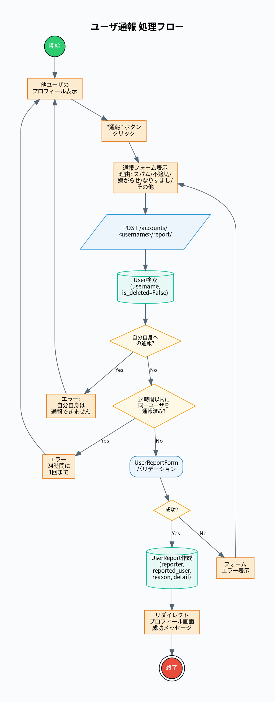

### 概要
他ユーザを通報する機能。24時間に同一ユーザへの通報は1回まで。

### 主要ファイル
| ファイル | 役割 |
|:---|:---|
| `accounts/views.py` | `UserReportView` |
| `accounts/models.py` | `UserReport` |
| `accounts/forms.py` | `UserReportForm` |

### フロー詳細
1. 他ユーザのプロフィール → 「通報」ボタン
2. 通報フォーム: 理由（スパム / 不適切 / 嫌がらせ / なりすまし / その他）+ 詳細
3. バリデーション:
   - 自分自身への通報 → エラー
   - 24時間以内の同一ユーザ通報 → エラー
4. `UserReport` 作成 → プロフィール画面へリダイレクト

---

## 19. 質問編集

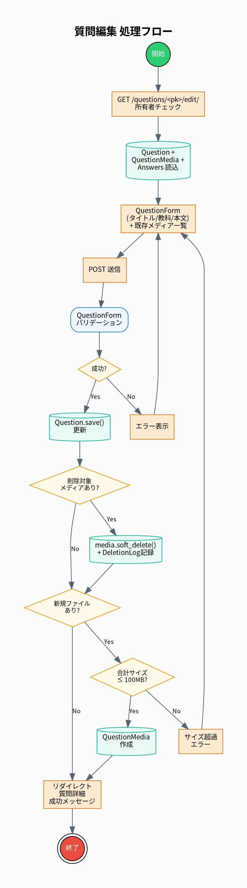

### 概要
質問のタイトル・教科・本文を編集し、メディアの追加/削除を行う機能。

### 主要ファイル
| ファイル | 役割 |
|:---|:---|
| `questions/views.py` | `QuestionEditView` |

### フロー詳細
1. `get_object_or_404(Question, pk=pk, user=request.user)` — 所有者のみ
2. `QuestionForm(instance=question)` + 既存メディア一覧表示
3. 更新: `form.save()` → メディア削除 (`soft_delete()` + `DeletionLog`) → 新規メディア追加
4. サイズ制限: 既存 + 新規の合計 ≤ 100MB

---

## 20. 自動補完 (AutoSupplement)

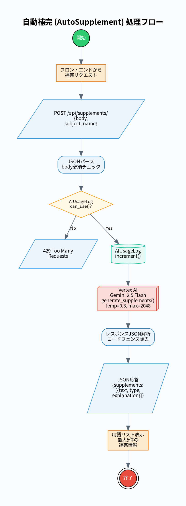

### 概要
回答本文中の重要な専門用語や数式を AI が自動検出し、簡潔な説明を生成する機能。

### 主要ファイル
| ファイル | 役割 |
|:---|:---|
| `questions/views.py` | `AutoSupplementView` |
| `questions/services/gemini_service.py` | `generate_supplements()` |

### フロー詳細
1. `POST /api/supplements/` に `{body, subject_name}`
2. `AIUsageLog.can_use()` チェック → 429 if 制限超過
3. `AIUsageLog.increment()` → `generate_supplements()` (Gemini 2.5 Flash, temp=0.3)
4. 最大5件の `{text, type, explanation}` を JSON 配列で返却
5. コードフェンス除去後にパース

---

## 21. AI使用回数制限

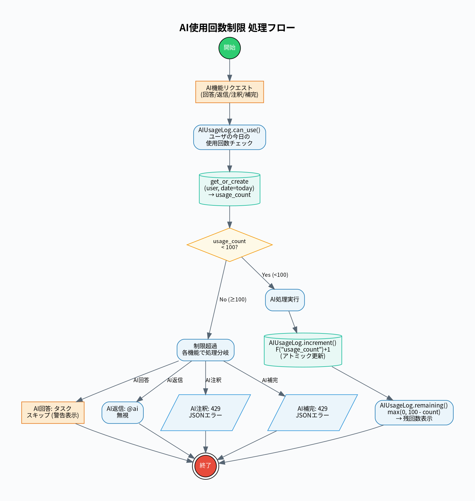

### 概要
1アカウント1日100回の AI API コール制限。全 AI 機能で横断的に適用。

### 主要ファイル
| ファイル | 役割 |
|:---|:---|
| `questions/models.py` | `AIUsageLog` (`unique_together: [user, date]`) |

### フロー詳細
1. `can_use(user)`: `get_or_create(user, date=today)` → `usage_count < 100`
2. `increment(user)`: `F('usage_count') + 1` (アトミック更新)
3. `remaining(user)`: `max(0, 100 - count)`

### 各機能での制限時動作
| 機能 | 制限時の動作 |
|:---|:---|
| AI 回答生成 | タスクスキップ、警告表示 |
| AI 返信 | `@ai` 無視 |
| AI 注釈 | 429 JSON エラー |
| AI 補完 | 429 JSON エラー |

---

## 22. メディアアップロード

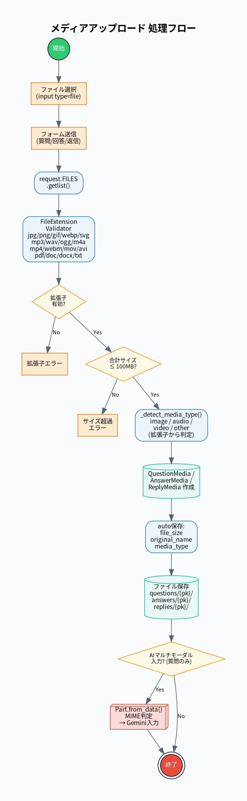

### 概要
質問・回答・返信に画像/音声/動画/文書ファイルを添付する機能。

### 主要ファイル
| ファイル | 役割 |
|:---|:---|
| `questions/views.py` | `_save_media()` |
| `questions/models.py` | `QuestionMedia`, `AnswerMedia`, `ReplyMedia` |
| `questions/tasks.py` | マルチモーダルメディア収集 |

### フロー詳細
1. ファイル選択 → フォーム送信 → `request.FILES.getlist()`
2. `FileExtensionValidator`: jpg/png/gif/webp/svg/mp3/wav/ogg/m4a/mp4/webm/mov/avi/pdf/doc/docx/txt
3. 合計サイズ ≤ 100MB チェック
4. `_detect_media_type()`: 拡張子から自動判定 (image/audio/video/other)
5. メディアモデル作成 → `file_size`, `original_name`, `media_type` 自動設定
6. アップロードパス: `questions/{pk}/`, `answers/{pk}/`, `replies/{pk}/`
7. AI 回答生成時: `Part.from_data()` でマルチモーダル入力に使用
8. 削除時: `django-cleanup` がファイルを自動削除
